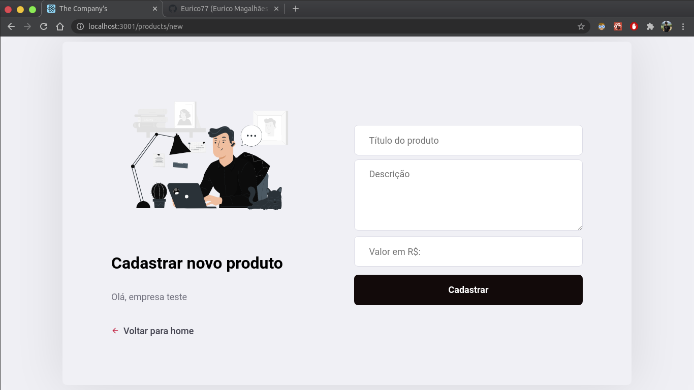
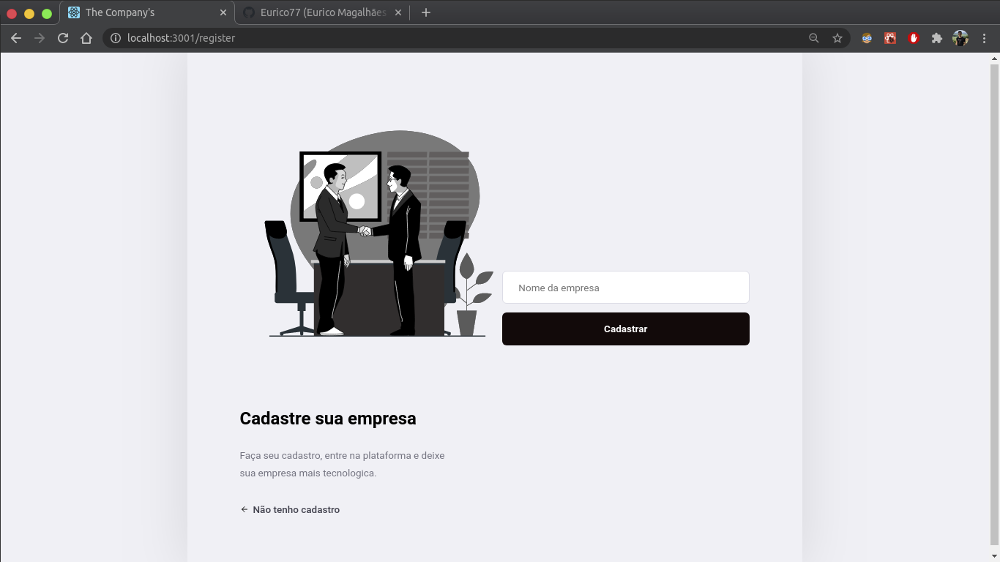
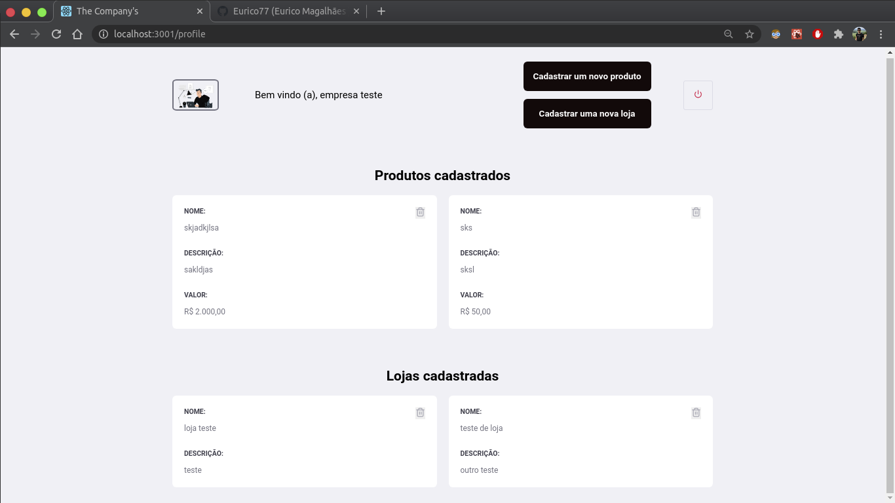

<!-- então bora codar! -->


<h2 align="center"> Aplicação de desafio para admissão da empresa Casa Magalhães </h2>

<h3 align="center"> Criada com a stack     React, Node e Postgres </h3>


<p align="center"> Usando o poder de uma stack poderosa, que utiliza de uma única linguagem popular e moderna, o  JavaScript. <br> Produtividade e performance de forma enxuta. </p> <br>
devido ao tempo que foi estipulado, tive que recorrer ao maximo de funcionalidades que pude implementar.


---

## Para rodar a aplicação

> OBS: pode-se utilizar o gerenciador de pacotes npm ou o yarn para rodar os comandos abaixo

Execute ```npm install``` nas pastas backend, frontend para instalar as dependências.

Rode ```npm start```  e   ``yarn start`` nas pastas backend e frontend para utilizar a versão web. Acesse via **localhost:3000**.

## Telas

<p align="center">
    
    
    
   
</p>


---


---

<h4 align="center"> <em>&lt;/&gt;</em> by <a href="https://github.com/Eurico77" target="_blank">Eurico Magalhaes</a> </h4>
